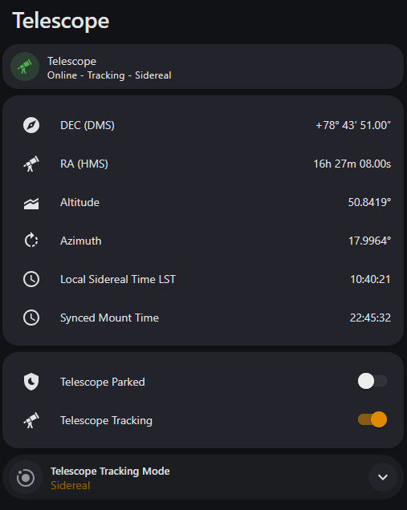

# LX200 Telescope — Home Assistant Integration

[](https://github.com/hacs/integration)
[](https://github.com/Jaarden/HA-LX200-OnStep/releases)
[](LICENSE)

A Home Assistant custom integration that connects to an LX200-compatible telescope mount over TCP. It exposes live coordinate sensors, status sensors, and full mount controls — all as native HA entities with no MQTT broker required.

**Author:** Justin Aarden  
**Repository:** [Jaarden/HA-LX200-OnStep](https://github.com/Jaarden/HA-LX200-OnStep)

---

## Features

- Live **RA, DEC, Altitude, Azimuth** sensors — decimal and formatted (HMS / DMS)
- **Local Sidereal Time** and **Mount Time** sensors
- **Tracking Rate** sensor — Sidereal / Lunar / Solar / Off, polled from the mount every cycle
- **Connectivity** binary sensor — Online / Offline
- **Guiding** binary sensor — active when the autoguider is sending corrections
- **Park Status** sensor — Parked / Not parked / Parking / Park failed
- **Directional motion** buttons — Move North / South / East / West and Stop
- **Slew Rate** selector — 0.5× to Max (8 steps)
- **Tracking Mode** selector — Sidereal / Lunar / Solar; reflects external changes (app, hand controller)
- **Tracking** switch — enable or disable mount tracking; state is read from the mount, not guessed
- **Park / Unpark** switch — parks or resumes from park; state read from mount status
- **Go to Home** button — slews to the Counterweight Down position, then automatically unparks
- **Set Home** button — saves the current position as the home reference, then stops tracking so the mount is ready to move
- **Set Park Position** button — saves the current position as the park position
- **Sync Time** button — pushes the current HA date and time to the mount
- Configurable poll interval (default 10 s)
- No MQTT broker required — talks directly to the mount over TCP
- Full UI setup via **Settings → Integrations** (no `configuration.yaml` edits)
- Compatible with any LX200-protocol mount: **OnStep**, **iOptron**, **Celestron**, **SkyWatcher**, **Meade**, and others

---

## Requirements

| Requirement | Details |
|---|---|
| Home Assistant | 2023.1.0 or newer |
| Mount firmware | LX200 protocol over TCP |
| Network access | HA must be able to reach the mount's IP and TCP port |

The integration communicates with the mount's built-in TCP server (e.g. OnStep's WiFi interface) or a serial-to-TCP bridge such as `ser2net`. No extra Python packages are required.

---

## Installation

### Via HACS (recommended)

1. Open HACS in Home Assistant.
2. Go to **Integrations** → click the three-dot menu → **Custom repositories**.
3. Add `https://github.com/Jaarden/HA-LX200-OnStep` with category **Integration**.
4. Search for **LX200 Telescope** and click **Download**.
5. Restart Home Assistant.

### Manual

1. Download or clone this repository.
2. Copy the `custom_components/telescope_lx200/` folder into your HA config directory:
   ```
   config/
   └── custom_components/
       └── telescope_lx200/
   ```
3. Restart Home Assistant.

---

## Configuration

1. Go to **Settings → Integrations → Add Integration**.
2. Search for **LX200 Telescope**.
3. Fill in the connection details:

| Field | Description | Default |
|---|---|---|
| Host / IP address | IP address of the mount or TCP bridge | — |
| TCP port | Port the mount listens on (see table below) | `9999` |
| Poll interval | How often to query the mount, in seconds | `10` |

4. Click **Submit** — the integration validates the connection before saving.

### Common TCP ports

| Mount / Software | Port |
|---|---|
| OnStep (WiFi) | `4031` |
| iOptron mounts | `8899` |
| ser2net / socat bridge | user-defined |
| StellariumScope | `10001` |

---

## Entities

All entities are grouped under a single **Telescope** device in Home Assistant.

### Sensors

| Entity | Unit | Description |
|---|---|---|
| `sensor.telescope_ra` | h | Right Ascension (decimal hours) |
| `sensor.telescope_ra_hms` | — | Right Ascension formatted as `HHh MMm SS.SSs` |
| `sensor.telescope_dec` | ° | Declination (decimal degrees) |
| `sensor.telescope_dec_dms` | — | Declination formatted as `+DD° MM′ SS.SS″` |
| `sensor.telescope_altitude` | ° | Current altitude above horizon |
| `sensor.telescope_azimuth` | ° | Current azimuth |
| `sensor.telescope_local_sidereal_time` | — | Local Sidereal Time string |
| `sensor.telescope_mount_time` | — | Local time reported by the mount (HH:MM:SS) |
| `sensor.telescope_tracking_rate` | — | Current tracking rate: Sidereal / Lunar / Solar / Off |
| `sensor.telescope_park_status` | — | Park state: Parked / Not parked / Parking / Park failed |

The integration automatically switches the mount to **high-precision mode** (`:U#`) on the first poll so RA is returned as `HH:MM:SS` rather than `HH:MM.T`. Both formats are parsed correctly.

### Binary Sensors

| Entity | States | Description |
|---|---|---|
| `binary_sensor.telescope_connection` | Online / Offline | Whether the mount is reachable over TCP |
| `binary_sensor.telescope_guiding` | On / Off | Whether the autoguider is actively sending corrections (`:GU#` `G` flag) |

> **Guiding vs Tracking:** The Guiding sensor reflects the `G` flag in the OnStep status response, which means the autoguider is sending pulse-guide corrections. It is independent of whether sidereal tracking is enabled. Use the **Tracking** switch to control tracking on/off.

The connection sensor flips to **Offline** as soon as a poll fails and recovers to **Online** on the next successful poll — no manual intervention required.

### Buttons

| Entity | LX200 Command | Description |
|---|---|---|
| `button.telescope_move_north` | `:Mn#` | Begin slewing north |
| `button.telescope_move_south` | `:Ms#` | Begin slewing south |
| `button.telescope_move_east` | `:Me#` | Begin slewing east |
| `button.telescope_move_west` | `:Mw#` | Begin slewing west |
| `button.telescope_stop_motion` | `:Q#` | Stop all motion immediately |
| `button.telescope_go_to_home` | `:hC#` then `:hR#` | Slew to the Counterweight Down position, then unpark |
| `button.telescope_set_home` | `:hF#` then `:Td#` | Save the current position as home, then stop tracking |
| `button.telescope_set_park` | `:hQ#` | Save the current position as the park position |
| `button.telescope_sync_time` | `:SC…#` `:SL…#` | Push the current HA date and time to the mount |

> **Motion workflow:** Press a directional button to start slewing, then press **Stop Motion** when the target is reached. The slew continues until stopped.

> **Go to Home workflow:** Slews to the saved Counterweight Down (CWD) position and immediately unparks so the mount is ready for movement. The home position is defined in firmware — it is not the same as a GoTo target.

> **Set Home workflow:** Resets the encoder reference to the current physical position. The mount must be physically at the CWD position for DEC / Az to read correctly afterwards. Tracking is automatically stopped after the reset so the mount is ready for movement.

> **Park workflow:** Point the scope at your desired park position and press **Set Park Position**. The **Parked** switch will then move the mount to that position when turned on, and unpark when turned off.

### Selectors

| Entity | Options | LX200 Commands | Description |
|---|---|---|---|
| `select.telescope_slew_rate` | 0.5× … Max | `:R1#` – `:R9#` | Controls how fast the directional buttons move the mount |
| `select.telescope_tracking_mode` | Sidereal, Lunar, Solar | `:TQ#` `:TL#` `:TS#` | Sets the tracking rate; reflects changes made from any source |

**Slew rates:**

| Option | Command | Use case |
|---|---|---|
| **0.5×** | `:R1#` | Fine guiding corrections |
| **1×** | `:R2#` | Sidereal rate |
| **2×** | `:R3#` | Slow centering |
| **4×** | `:R4#` | Centering |
| **8×** | `:R5#` | Fast centering |
| **20×** | `:R6#` | Searching nearby sky |
| **48×** | `:R7#` | Fast repositioning |
| **Max** | `:R9#` | Full-speed slew |

The **Tracking Mode** selector reads its current state from the mount on every poll (via `:GT#`) so it stays in sync when the rate is changed from the OnStep app, a hand controller, or any other LX200 client. The selector shows no selection when tracking is off — use the **Tracking** switch to enable or disable tracking.

### Switches

| Entity | Commands | Description |
|---|---|---|
| `switch.telescope_tracking` | `:Te#` / `:Td#` | Enables or disables mount tracking |
| `switch.telescope_parked` | `:hP#` / `:hR#` | Parks or unparks the mount |

**Tracking switch:** State is derived from `:GT#` — the mount reports `0 Hz` when tracking is off and a positive rate (e.g. `60.16 Hz`) when on. This means the switch reflects the actual tracking state even when toggled from the OnStep app, a hand controller, or any other client. If the firmware does not respond to `:GT#`, the switch operates optimistically and reflects the last command sent from HA.

**Park switch:** State is read from the OnStep status flags (`:GU#`) on every poll. `P` = Parked, `p` = Not parked, `I` = Parking in progress, `F` = Park failed. Falls back to optimistic state when the firmware does not report park status.

Both switches become **unavailable** when the mount is offline.

---

## Dashboard



The dashboard shows live coordinates in formatted HMS / DMS, mount status, park and tracking controls, and the tracking mode selector. The whole card is hidden when the mount is offline.

The full Lovelace YAML is in [`examples/dashboard1.yml`](examples/dashboard1.yml).

### Custom card dependencies

The example card uses two HACS frontend integrations:

| Card | HACS repository | Purpose |
|---|---|---|
| [Mushroom Cards](https://github.com/piitaya/lovelace-mushroom) | `piitaya/lovelace-mushroom` | Styled header card with template subtitle and colour-coded icon |
| [Bubble Card](https://github.com/Clooos/Bubble-Card) | `Clooos/Bubble-Card` | Compact select card for the Tracking Mode dropdown |

### How the header works

The `mushroom-template-card` at the top builds its subtitle from entity states:

| Mount state | Subtitle shown | Icon colour |
|---|---|---|
| Tracking (Sidereal / Lunar / Solar) | `Online - Tracking - Sidereal` | Green |
| Parked | `Online - Parked` | Orange |
| Standby (tracking off, not parked) | `Online - Standby` | Blue |
| Offline | *(whole card hidden)* | — |

The Tracking Mode select card is conditionally hidden when the **Tracking** switch is off, so it only appears when there is an active tracking rate to change.

---

## Example Automations

**Turn on a red-light switch when the telescope comes online:**

```yaml
automation:
  - alias: "Telescope session started"
    trigger:
      - platform: state
        entity_id: binary_sensor.telescope_connection
        to: "on"
    action:
      - service: switch.turn_on
        target:
          entity_id: switch.observatory_red_light
```

**Notify when the mount goes offline:**

```yaml
automation:
  - alias: "Telescope lost connection"
    trigger:
      - platform: state
        entity_id: binary_sensor.telescope_connection
        to: "off"
    action:
      - service: notify.persistent_notification
        data:
          message: "Telescope mount has gone offline."
```

**Nudge north at guide speed for 2 seconds:**

```yaml
script:
  nudge_north:
    sequence:
      - service: select.select_option
        target:
          entity_id: select.telescope_slew_rate
        data:
          option: "0.5x"
      - service: button.press
        target:
          entity_id: button.telescope_move_north
      - delay: "00:00:02"
      - service: button.press
        target:
          entity_id: button.telescope_stop_motion
```

**Switch to Lunar tracking rate:**

```yaml
service: select.select_option
target:
  entity_id: select.telescope_tracking_mode
data:
  option: Lunar
```

---

## Troubleshooting

**Sensors show "Unavailable"**  
The mount is not reachable. Check:
- The mount's WiFi / TCP server is enabled and running.
- The IP address and port match what the mount reports.
- Home Assistant and the mount are on the same network (or a route exists).
- No firewall is blocking the TCP port.

**Connection sensor stays Offline after mount comes back**  
The integration retries on every poll interval. Wait one poll cycle (default 10 s) and it will recover automatically.

**RA / DEC reads 0.0 or doesn't update**  
- The integration sends `:U#` automatically to switch to high-precision mode — confirm your firmware supports this.
- Some firmware only reports coordinates once the motor controller is initialised. Ensure the mount is fully connected in your planetarium software (e.g. KStars / Ekos) before querying.

**Tracking switch doesn't reflect changes made in the OnStep app**  
The tracking switch reads its state from `:GT#` on every poll. If the switch still lags, check that your firmware responds to `:GT#` — older or non-OnStep firmware may not support it, in which case the switch falls back to optimistic mode.

**Tracking Mode selector shows no selection**  
This is normal when tracking is off — the selector only shows a value when the mount is actively tracking. Enable tracking with the **Tracking** switch first, then the selector will show the current rate.

**Go to Home does nothing**  
The home position is defined in OnStep firmware as the Counterweight Down (CWD) position. If your firmware does not have a home position configured, `:hC#` may have no effect.

**Set Home does not update DEC / Azimuth to expected values**  
`:hF#` resets the encoder reference to the current physical position. DEC will only read 90° and Az will only read 0° if the mount is physically at the CWD position when the button is pressed.

**Park switch does not respond**  
Some older firmware versions use different park commands. If `:hP#` / `:hR#` do not work with your mount, check your firmware documentation for the correct park/unpark commands.

---

## Contributing

Issues and pull requests are welcome at [Jaarden/HA-LX200-OnStep](https://github.com/Jaarden/HA-LX200-OnStep/issues).

---

## License

MIT License — see [LICENSE](LICENSE) for details.
